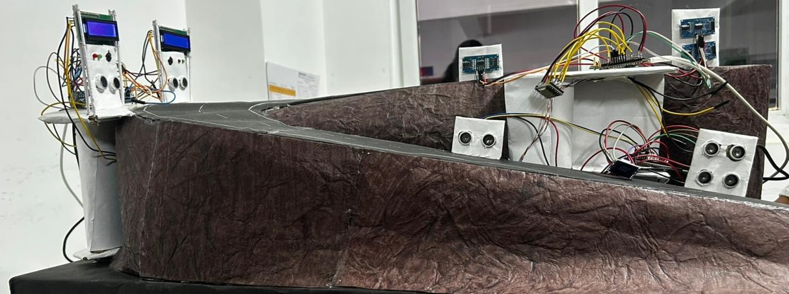
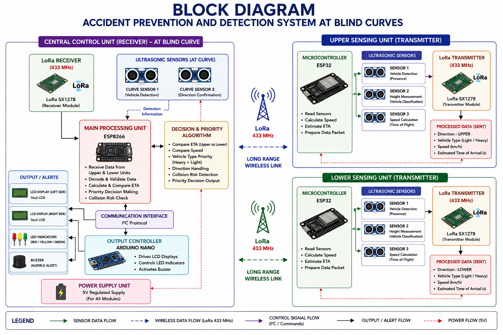
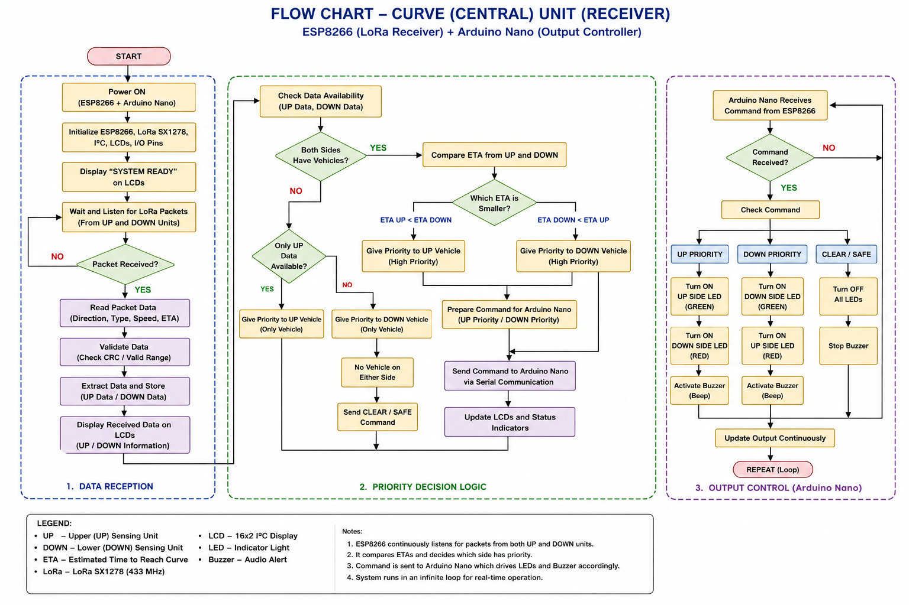
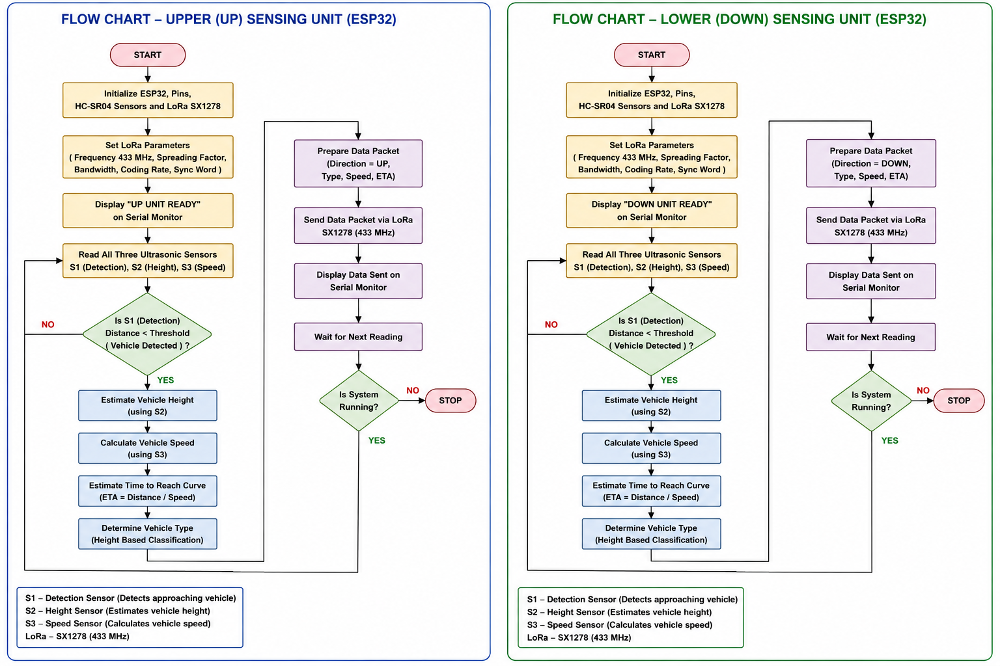

# 🚧 Accident Prevention System at Blind Curves

<p align="center">

# 🚗 Accident Prevention System at Blind Curves

### A Multi-Controller Embedded System for Vehicle Detection, Speed Estimation, ETA Prediction, Wireless Warning and Visual Monitoring

</p>

<p align="center">


</p>

---

# 📌 Overview

The **Accident Prevention System at Blind Curves** is a multi-controller embedded road-safety system designed to reduce the risk of collisions at **blind curves, sharp turns, narrow roads, hairpin bends, and hilly roads** where drivers cannot directly see vehicles approaching from the opposite direction.

The system combines:

* **Vehicle detection**
* **Vehicle classification**
* **Speed estimation**
* **Estimated Time of Arrival (ETA) calculation**
* **Long-range LoRa communication**
* **Dual-direction traffic monitoring**
* **Priority-based decision making**
* **LCD-based driver information**
* **LED warning indicators**
* **Audible warning**
* **ESP32-CAM visual monitoring**
* **Wi-Fi live video streaming**
* **Timestamped video recording**

The project uses multiple microcontrollers, with each controller assigned a specific responsibility.

The main architecture consists of:

```text
                UPPER SIDE       LOWER SIDE
                    │                 │
                 ESP32              ESP32
                    │                 │
                  LoRa              LoRa
                    │                 │
                    ▼                 ▼
                     ESP8266 RECEIVER
                            │
                           I²C
                            │
                            ▼
                       ARDUINO NANO
                            │
                  ┌─────────┼─────────┐
                  ▼         ▼         ▼
                 LEDs      Buzzer      Curve
                                       Detection


               
                         ESP32-CAM
                             │
                           Wi-Fi
                             │
                   ┌─────────┴──────────┐
                   ▼                    ▼
                Live Browser          OpenCV
                Monitoring          Recording
                               │
                               ▼
                       Timestamped Files
```

---

# 🎯 Problem Statement

Blind curves are dangerous because the road geometry prevents drivers from seeing vehicles approaching from the opposite direction.

Both vehicles may enter the curve without knowing that another vehicle is approaching.

This is particularly dangerous on:

* Mountain roads
* Hilly roads
* Narrow roads
* Hairpin bends
* Sharp turns
* Roads with restricted visibility

Traditional safety measures such as:

* Warning signs
* Convex mirrors
* Speed breakers
* Manual observation
* Vehicle horns

do not always provide real-time information about approaching vehicles.

The objective of this project is therefore to create an **active, real-time warning system** capable of detecting vehicles before they reach the blind curve and informing the driver on the opposite side.

---

# 💡 Proposed Solution

The system places vehicle-detection units on both sides of the blind curve.

Each side has an **ESP32 sensing node** containing three ultrasonic sensors.

The sensors are used for:

1. Detecting a vehicle.
2. Determining approximate vehicle type.
3. Measuring the time taken by the vehicle to travel between two sensing points.
4. Calculating vehicle speed.
5. Determining the direction of travel.
6. Estimating the time required to reach the curve.

The information is transmitted using **LoRa** to a central **ESP8266 NodeMCU**.

The ESP8266 maintains separate vehicle queues for the two directions and calculates the current traffic condition.

It then communicates the required warning state to an **Arduino Nano** through I²C.

The Nano controls:

* Red LEDs
* Green LEDs
* Buzzer

Two LCD displays connected to the ESP8266 provide information about approaching vehicles and their ETA.

An additional **ESP32-CAM** provides visual monitoring and recording of the curve.

---

# 🧠 Core Concept

The fundamental concept is:

> **Detect → Identify → Measure → Transmit → Calculate → Warn → Monitor**

The complete system can be represented as:

```text
Vehicle Approaches
        │
        ▼
Ultrasonic Detection
        │
        ▼
Vehicle Classification
        │
        ▼
Speed Measurement
        │
        ▼
ETA Calculation
        │
        ▼
LoRa Transmission
        │
        ▼
ESP8266 Central Controller
        │
        ▼
Traffic Queue
        │
        ▼
Priority Decision
        │
        ▼
Arduino Nano
        │
        ├────────► Green / Red LEDs
        │
        └────────► Buzzer
        │
        ▼
Driver Warning
```

At the same time:

```text
Blind Curve
    │
    ▼
ESP32-CAM
    │
    ▼
Wi-Fi
    │
    ├────────► Live Browser Stream
    │
    └────────► OpenCV Recorder
                       │
                       ▼
                Timestamped Video
```

---

# 🏗️ Complete System Architecture

```text
                              BLIND CURVE
                         ╱                  ╲
                        ╱                    ╲
                       ╱                      ╲
                      ╱                        ╲
                     🚗                        🚙
                     │                          │
                     ▼                          ▼
              ┌─────────────┐            ┌─────────────┐
              │ ESP32       │            │ ESP32       │
              │ UPPER NODE  │            │ LOWER NODE  │
              └──────┬──────┘            └──────┬──────┘
                     │                          │
                     │        LoRa              │
                     └───────────┬──────────────┘
                                 │
                                 ▼
                       ┌──────────────────┐
                       │ ESP8266 NodeMCU  │
                       │ Central Receiver │
                       └────────┬─────────┘
                                │
                           I²C / Wire
                                │
                                ▼
                       ┌──────────────────┐
                       │  Arduino Nano    │
                       │ Output Controller│
                       └───────┬──────────┘
                               │
                  ┌────────────┼────────────┐
                  ▼            ▼            ▼
              UP LEDs       DOWN LEDs     Buzzer
                  │            │
                  └──────┬─────┘
                         ▼
                    Driver Alert


                       ESP32-CAM
                           │
                         Wi-Fi
                           │
                 ┌─────────┴─────────┐
                 ▼                   ▼
            Web Browser           OpenCV
            Live Stream          Recorder
                                      │
                                      ▼
                              Timestamped MP4
```

---

# 🔧 Hardware Architecture

## 1. ESP32 Upper Node

One ESP32 is installed on the **upper side of the blind curve**.

It uses three ultrasonic sensors:

```text
U1 → Vehicle detection
U2 → Vehicle height/type detection
U3 → Speed measurement
```

The node determines:

* Vehicle presence
* Vehicle type
* Speed
* Direction
* Distance to curve

The resulting information is transmitted through LoRa.

---

# 2. ESP32 Lower Node

The second ESP32 is installed on the **lower side of the blind curve**.

It uses the same sensing arrangement:

```text
U1 → Vehicle detection
U2 → Vehicle height/type detection
U3 → Speed measurement
```

The lower node generates packets with the direction:

```text
DOWN
```

while the upper node generates:

```text
UP
```

---

# 3. ESP8266 NodeMCU

The **ESP8266 NodeMCU** is the central controller.

It receives vehicle information from both ESP32 nodes through LoRa.

Its main responsibilities are:

* LoRa packet reception
* Packet parsing
* Vehicle queue management
* ETA calculation
* Vehicle removal
* Priority calculation
* LCD control
* Communication with Arduino Nano
* Monitoring vehicle passage at the curve

The ESP8266 therefore acts as the **decision-making and information-management controller**.

---

# 4. Arduino Nano

The Arduino Nano acts as the **output and curve-monitoring controller**.

It receives a system-state command from the ESP8266 through I²C.

It controls:

* Upper green LED
* Upper red LED
* Lower green LED
* Lower red LED
* Buzzer

It also has two additional ultrasonic sensors to detect when a vehicle has actually passed the curve.

The Nano communicates vehicle-passage information back to the ESP8266 through dedicated digital pulse outputs.

---

# 5. ESP32-CAM

The **AI-Thinker ESP32-CAM** is the visual monitoring component.

It provides:

* Camera capture
* Wi-Fi connectivity
* Browser-based live streaming
* Local network access
* Visual monitoring of the blind curve

The current firmware uses the standard ESP32 Camera Web Server architecture with:

```text
CAMERA_MODEL_AI_THINKER
```

The camera can be accessed through the IP address assigned by the Wi-Fi network.

Example:

```text
http://<ESP32-CAM-IP>
```

---

# 6. LoRa SX1278

The project uses **three SX1278 433 MHz LoRa modules**.

```text
ESP32 Upper
     │
   LoRa
     │
     ├──────────────┐
     │              │
ESP32 Lower         │
     │              │
   LoRa              ▼
                ESP8266
```

LoRa is used because the blind-curve nodes may need communication over longer distances than ordinary short-range wired connections.

The current configuration uses:

```text
Frequency        : 433 MHz
Spreading Factor : 7
Bandwidth        : 125 kHz
Coding Rate      : 4/5
TX Power         : 17
Preamble Length  : 8
Sync Word        : 0x12
CRC              : Enabled
```

---

# 📡 Communication Architecture

The project uses multiple communication methods.

## LoRa

Used between:

```text
ESP32 Upper Node
        ↓
      LoRa
        ↓
ESP8266 Central Controller
```

and:

```text
ESP32 Lower Node
        ↓
      LoRa
        ↓
ESP8266 Central Controller
```

## I²C

Used between:

```text
ESP8266
   │
  I²C
   │
Arduino Nano
```

The Nano is configured as I²C address:

```text
8
```

## Digital Pulse

Used by the Nano to inform the ESP8266 when a vehicle has passed the monitored curve region.

## Wi-Fi

Used by:

```text
ESP32-CAM
     ↓
 Wi-Fi Network
     ↓
Phone / PC Browser
```

and for the OpenCV recording application.

---

# 🚗 Vehicle Detection

Each ESP32 sensing node uses three HC-SR04 ultrasonic sensors.

### Sensor U1 — Vehicle Detection

The first sensor detects the arrival of a vehicle.

When the measured distance becomes less than approximately:

```text
15 cm
```

the system registers a vehicle.

---

# 🚛 Vehicle Classification

The second ultrasonic sensor is used to estimate vehicle height.

The current classification is:

```text
U1 detects vehicle
        │
        ▼
Check U2
        │
    ┌───┴────┐
    │        │
  <15 cm   >=15 cm
    │        │
    ▼        ▼
  HEAVY     LIGHT
```

Therefore, the system currently classifies vehicles as:

```text
LIGHT
HEAVY
```

This is an experimental prototype classification based on the sensor geometry and should not be interpreted as a production-grade vehicle-classification method.

---

# ⏱️ Speed Measurement

The ESP32 uses two sensing points separated by:

```text
SENSOR_DISTANCE = 0.20 m
```

The time between detection at the first and second measurement points is used to calculate speed.

The basic equation is:

```text
Speed = Distance / Time
```

The calculated speed in m/s is converted to km/h:

```text
Speed(km/h) = Speed(m/s) × 3.6
```

Example:

```text
Distance = 0.20 m
Time     = measured travel time

Speed = 0.20 / Time
```

---

# 📍 Curve Distance

The current prototype uses:

```text
CURVE_DISTANCE = 1.0 m
```

as the distance from the sensing point to the curve.

This value is used by the central controller for ETA calculation.

For an actual road deployment, this parameter would be changed according to the physical installation.

---

# ⏳ ETA Calculation

The ESP8266 calculates the estimated time required for a vehicle to reach the curve.

The basic equation is:

```text
ETA = Distance / Speed
```

The code converts speed from km/h to m/s:

```text
Speed(m/s) = Speed(km/h) / 3.6
```

Therefore:

```text
ETA = DEMO_DISTANCE / (Speed / 3.6)
```

If the speed is extremely low, the system assigns a large ETA value rather than dividing by a near-zero speed.

---

# 📦 LoRa Data Packet

The ESP32 nodes transmit vehicle information in a simple comma-separated format.

Example:

```text
UP,HEAVY,24.5,1
```

or:

```text
DOWN,LIGHT,18.2,1
```

The fields represent:

```text
Direction,Vehicle Type,Speed,Curve Distance
```

For example:

```text
UP
```

means the vehicle is travelling from the upper side.

```text
HEAVY
```

represents the detected vehicle type.

```text
24.5
```

represents the calculated speed in km/h.

```text
1
```

represents the configured curve distance in metres.

---

# 🧮 Central Vehicle Queue

The ESP8266 maintains two independent queues:

```text
UP Queue
DOWN Queue
```

Each vehicle stores:

```text
Direction
Vehicle Type
Speed
ETA
Received Time
Active State
```

The maximum queue size in the current implementation is:

```text
MAX_QUEUE = 5
```

Therefore:

```text
              ESP8266
                 │
        ┌────────┴────────┐
        ▼                 ▼
    UP Queue           DOWN Queue
   Maximum 5          Maximum 5
    vehicles            vehicles
```

This allows the system to handle multiple approaching vehicles rather than only a single vehicle.

---

# 🔄 Queue Operation

When a new vehicle packet arrives:

```text
LoRa Packet
    │
    ▼
Parse Packet
    │
    ▼
Determine Direction
    │
    ├─────────────┐
    ▼             ▼
 UP Queue      DOWN Queue
```

If a queue becomes full, the oldest vehicle is removed before adding the new vehicle.

---

# 🚦 Priority Logic

The central controller uses four primary states:

```text
0 = SAFE
1 = ABOVE VEHICLE ONLY
2 = BELOW VEHICLE ONLY
3 = BOTH SIDES
```

### State 0 — Safe

No vehicle is approaching.

```text
UP   → CLEAR
DOWN → CLEAR
```

Both sides show:

```text
No Vehicle
SAFE TO GO
```

---

### State 1 — Vehicle Above Only

A vehicle is approaching from the upper direction.

The system warns the lower side.

```text
UP   → Vehicle
DOWN → Warning
```

---

### State 2 — Vehicle Below Only

A vehicle is approaching from the lower direction.

The system warns the upper side.

```text
UP   → Warning
DOWN → Vehicle
```

---

### State 3 — Vehicles From Both Sides

Vehicles are approaching from both directions.

The system enters the highest-warning state.

The buzzer is activated intermittently.

---

# 🚨 Warning System

The Arduino Nano controls four LEDs:

```text
UP GREEN
UP RED

DOWN GREEN
DOWN RED
```

and one buzzer.

The current output states are:

| System State | Upper Side | Lower Side | Buzzer   |
| ------------ | ---------- | ---------- | -------- |
| SAFE         | 🟢 Green   | 🟢 Green   | OFF      |
| ABOVE ONLY   | 🟢 Green   | 🔴 Red     | OFF      |
| BELOW ONLY   | 🔴 Red     | 🟢 Green   | OFF      |
| BOTH SIDES   | 🔴 Red     | 🟢 Green   | Flashing |

The warning logic is designed to provide immediate information to drivers approaching the curve.

---

# 📺 Dual LCD Display

The ESP8266 controls two 16×2 I²C LCD displays.

The LCDs represent the two sides of the curve:

```text
Upper LCD
Lower LCD
```

When no vehicle is present:

```text
No Vehicle
SAFE TO GO
```

When a vehicle approaches:

```text
Vehicle Below
ETA:03 GO SLOW
```

or:

```text
Vehicle Above
ETA:02 PROCEED
```

depending on the current traffic state.

Longer messages can be scrolled across the LCD.

---

# 🔔 Vehicle-Passed Detection

The Arduino Nano contains two additional ultrasonic sensors:

```text
Upper Curve Sensor
Lower Curve Sensor
```

These sensors detect when vehicles have passed the monitored curve region.

When a vehicle passes:

```text
Nano Sensor
     │
     ▼
Vehicle Passed
     │
     ▼
Digital Pulse
     │
     ▼
ESP8266
     │
     ▼
Remove Vehicle From Queue
     │
     ▼
Update Priority
     │
     ▼
Update Displays
```

This prevents vehicles that have already passed the curve from remaining indefinitely in the central queue.

---

# 🧩 Complete System Operation

The complete process is:

```text
                    VEHICLE APPROACHES
                           │
                           ▼
                    U1 Detection
                           │
                           ▼
                 Vehicle Registered
                           │
                           ▼
                    U2 Measurement
                           │
                           ▼
              LIGHT / HEAVY Classification
                           │
                           ▼
                    U3 Detection
                           │
                           ▼
                    Speed Calculation
                           │
                           ▼
                    Direction Added
                           │
                           ▼
                    ETA Calculation
                           │
                           ▼
                     LoRa Packet
                           │
                           ▼
                    ESP8266 Receiver
                           │
                           ▼
                     Queue Storage
                           │
                           ▼
                    Priority Logic
                           │
                           ▼
                      I²C Command
                           │
                           ▼
                     Arduino Nano
                           │
              ┌────────────┼────────────┐
              ▼            ▼            ▼
          Red/Green      Buzzer       Curve
             LEDs                     Sensors
              │                         │
              ▼                         ▼
         Driver Alert             Vehicle Passed
                                        │
                                        ▼
                                  Queue Updated
```

---

# 📹 ESP32-CAM Visual Monitoring

The ESP32-CAM is an additional subsystem for monitoring the blind curve.

It is configured for the:

```text
AI-Thinker ESP32-CAM
```

camera model.

The ESP32-CAM connects to Wi-Fi and starts a camera web server.

```text
ESP32-CAM
    │
    ▼
Camera Sensor
    │
    ▼
JPEG Frames
    │
    ▼
Wi-Fi
    │
    ▼
Web Server
    │
    ▼
Browser
```

---

# 🌐 Live Camera Stream

Once the ESP32-CAM connects to Wi-Fi, its local IP address is displayed through the Serial Monitor.

Example:

```text
Camera Ready! Use 'http://192.168.x.x' to connect
```

The exact address depends on the Wi-Fi network.

The ESP32-CAM can be connected to:

* Wi-Fi router
* Mobile hotspot
* Local wireless network

A phone hotspot can therefore be used for field testing.

---

# 📡 ESP32-CAM Network Flow

```text
             Wi-Fi Router / Hotspot
                       │
                       │
                       ▼
                 ESP32-CAM
                       │
                       ▼
                Local IP Address
                       │
          ┌────────────┴────────────┐
          ▼                         ▼
      Phone Browser            Laptop Browser
          │                         │
          └────────────┬────────────┘
                       ▼
                 Live Camera
```

---

# 🎥 Video Recording

The repository contains:

```text
Codes/blind_curve_recorder.py
```

This Python program uses:

```text
OpenCV
```

to connect to the ESP32-CAM stream.

The current stream URL in the script is:

```text
http://10.140.172.57:81/stream
```

This IP should be changed whenever the ESP32-CAM receives a different address from the network.

---

# 💾 Continuous Recording

The Python recorder continuously reads frames from the ESP32-CAM.

The recording duration is currently configured as:

```text
FILE_DURATION = 300 seconds
```

which equals:

```text
5 minutes
```

Therefore, the recorder automatically creates a new video file every five minutes.

Example:

```text
BlindCurve_2026-09-12_12-30-00.mp4
BlindCurve_2026-09-12_12-35-00.mp4
BlindCurve_2026-09-12_12-40-00.mp4
```

---

# ⏱️ Timestamp Overlay

The recorder adds the current date and time directly onto every video frame.

The timestamp format is:

```text
DD-MM-YYYY  HH:MM:SS
```

Example:

```text
12-09-2026  12:30:15
```

This provides a time reference for recorded events.

---

# 🗂️ Recording Folder

The Python program automatically creates:

```text
BlindCurve_Recordings/
```

if the directory does not already exist.

The recorded videos are stored inside this directory.

---

# 🔄 Stream Reconnection

The recording program also handles stream interruptions.

If the ESP32-CAM stream is lost:

```text
Stream Lost
    │
    ▼
Release Camera Connection
    │
    ▼
Attempt Reconnection
    │
    ▼
Resume Recording
```

This allows the recorder to recover from temporary network interruptions.

---

# 🖥️ Live + Recording Architecture

The camera subsystem operates as:

```text
                       ESP32-CAM
                           │
                           ▼
                     Camera Capture
                           │
                           ▼
                         Wi-Fi
                           │
                           ▼
                    HTTP Stream :81
                           │
              ┌────────────┴────────────┐
              ▼                         ▼
        Web Browser                 OpenCV
        Live Viewing               Recorder
                                        │
                                        ▼
                                  Timestamp
                                        │
                                        ▼
                                  MP4 Writer
                                        │
                                        ▼
                            BlindCurve_Recordings
```

---

# 🛠️ Hardware Requirements

The project documentation specifies the following main hardware:

| S.No. | Component               | Specification           |    Quantity |
| ----: | ----------------------- | ----------------------- | ----------: |
|     1 | ESP32 Development Board | ESP32 DevKit V1         |           2 |
|     2 | ESP8266                 | NodeMCU ESP-12E         |           1 |
|     3 | Arduino Nano            | ATmega328P              |           1 |
|     4 | LoRa Module             | SX1278, 433 MHz         |           3 |
|     5 | Ultrasonic Sensor       | HC-SR04                 |           8 |
|     6 | LCD Display             | 16×2 with I²C           |           2 |
|     7 | LED Indicators          | 5 mm                    |           4 |
|     8 | Active Buzzer           | 5 V                     |           1 |
|     9 | Jumper Wires            | Male-Male / Male-Female | As required |
|    10 | Power Supply            | 5 V DC                  |           3 |
|    11 | ESP32-CAM               | AI-Thinker              |           1 |
|    12 | Computer                | For OpenCV recording    |           1 |

The ESP32-CAM and recording subsystem were added after the original project documentation.

---

# 🔌 ESP32 Upper/Lower Node Pin Configuration

The ESP32 sensing nodes use:

```text
U1:
TRIG1 = GPIO 14
ECHO1 = GPIO 27

U2:
TRIG2 = GPIO 26
ECHO2 = GPIO 25

U3:
TRIG3 = GPIO 33
ECHO3 = GPIO 32
```

LoRa:

```text
SS   = GPIO 5
DIO0 = GPIO 4
```

Both the upper and lower ESP32 sensing programs use this hardware configuration.

The transmitted direction differs:

```text
sender_up   → UP
sender_down → DOWN
```

---

# 🔌 ESP8266 Pin Configuration

The ESP8266 central controller uses:

```text
LoRa SS   = GPIO 15
LoRa DIO0 = GPIO 16
```

Curve passage inputs:

```text
UP_PASS   = D3
DOWN_PASS = D4
```

I²C:

```text
SDA = D2
SCL = D1
```

LCD addresses:

```text
Upper LCD = 0x27
Lower LCD = 0x23
```

Arduino Nano:

```text
I²C Address = 8
```

---

# 🔌 Arduino Nano Pin Configuration

### Upper Curve Sensor

```text
TRIG_UP = D2
ECHO_UP = D3
```

### Lower Curve Sensor

```text
TRIG_DOWN = D4
ECHO_DOWN = D5
```

### Upper LEDs

```text
UP_GREEN = D6
UP_RED   = D7
```

### Lower LEDs

```text
DOWN_GREEN = D8
DOWN_RED   = D9
```

### Buzzer

```text
BUZZER = D10
```

### ESP8266 Signals

```text
UP_PASS   = D11
DOWN_PASS = D12
```

---

# 📁 Repository Structure

```text
Accident-Prevention-System-at-Blind-Curves/
│
├── BlockDiagram.png
│
├── Flow_Chart_Curve.png
├── Flow_Chart_esp32.png
│
├── Codes/
│   │
│   ├── ard_nan/
│   │   └── ard_nan.ino
│   │       └── Arduino Nano controller
│   │
│   ├── receiver8266/
│   │   └── receiver8266.ino
│   │       └── ESP8266 central receiver/controller
│   │
│   ├── sender_up/
│   │   └── sender_up.ino
│   │       └── Upper ESP32 sensing node
│   │
│   ├── sender_down/
│   │   └── sender_down.ino
│   │       └── Lower ESP32 sensing node
│   │
│   ├── CameraWebServer/
│   │   ├── CameraWebServer.ino
│   │   ├── app_httpd.cpp
│   │   ├── board_config.h
│   │   ├── camera_index.h
│   │   ├── camera_pins.h
│   │   ├── ci.yml
│   │   └── partitions.csv
│   │       └── ESP32-CAM web server
│   │
│   └── blind_curve_recorder.py
│       └── OpenCV timestamped recorder
│
├── Images/
│   ├── a1.jpeg
│   ├── a2.jpeg
│   ├── a3.jpeg
│   ├── a4.jpeg
│   ├── c1.jpeg
│   ├── c2.jpeg
│   ├── u1.jpeg
│   └── u2.jpeg
│
├── Doc.pdf
│
├── Presentation.pptx
│
└── README.md
```

---

# 📂 Code Description

## `sender_up/sender_up.ino`

Firmware for the upper ESP32 sensing node.

Functions:

* Reads three ultrasonic sensors.
* Detects vehicles.
* Classifies vehicle as LIGHT/HEAVY.
* Calculates speed.
* Creates `UP` LoRa packets.
* Sends vehicle information to the ESP8266.

---

## `sender_down/sender_down.ino`

Firmware for the lower ESP32 sensing node.

Functions:

* Reads three ultrasonic sensors.
* Detects vehicles.
* Classifies vehicle as LIGHT/HEAVY.
* Calculates speed.
* Creates `DOWN` LoRa packets.
* Sends vehicle information to the ESP8266.

---

## `receiver8266/receiver8266.ino`

Main central-controller firmware.

Functions:

* Receives LoRa packets.
* Parses vehicle information.
* Maintains UP/DOWN queues.
* Calculates ETA.
* Removes expired vehicles.
* Determines traffic priority.
* Updates LCDs.
* Sends commands to Arduino Nano.
* Detects vehicles after passing the curve.

---

## `ard_nan/ard_nan.ino`

Arduino Nano firmware.

Functions:

* Receives state commands through I²C.
* Controls LEDs.
* Controls buzzer.
* Detects vehicles passing the curve.
* Sends passage pulses to the ESP8266.

---

## `CameraWebServer/`

ESP32-CAM firmware.

Functions:

* Initializes AI-Thinker camera.
* Connects to Wi-Fi.
* Starts the camera web server.
* Provides live streaming.
* Displays the ESP32-CAM IP address.

---

## `blind_curve_recorder.py`

Python/OpenCV recording application.

Functions:

* Connects to ESP32-CAM stream.
* Reads camera frames.
* Adds date/time.
* Creates five-minute video files.
* Stores recordings.
* Displays live video.
* Reconnects if stream is lost.

---

# 💻 Software Requirements

## Embedded Development

* Arduino IDE
* ESP32 board package
* ESP8266 board package
* LoRa library
* LiquidCrystal_I2C library
* Wire/I²C library

## Camera Recording

Python 3.x with:

```text
OpenCV
```

Install OpenCV using:

```bash
pip install opencv-python
```

---

# 🚀 Installation

## 1. Clone the Repository

```bash
git clone https://github.com/roopeshARR/Accident-Prevention-System-at-Blind-Curves.git
```

```bash
cd Accident-Prevention-System-at-Blind-Curves
```

---

# 2. Upload Upper ESP32 Firmware

Open:

```text
Codes/sender_up/sender_up.ino
```

Select the appropriate ESP32 board and upload it to the upper sensing node.

---

# 3. Upload Lower ESP32 Firmware

Open:

```text
Codes/sender_down/sender_down.ino
```

Upload it to the lower sensing node.

---

# 4. Upload ESP8266 Firmware

Open:

```text
Codes/receiver8266/receiver8266.ino
```

Select the appropriate NodeMCU ESP8266 board and upload.

---

# 5. Upload Arduino Nano Firmware

Open:

```text
Codes/ard_nan/ard_nan.ino
```

Select Arduino Nano / ATmega328P and upload.

---

# 6. Configure ESP32-CAM

Open:

```text
Codes/CameraWebServer/CameraWebServer.ino
```

The current firmware is configured for:

```text
CAMERA_MODEL_AI_THINKER
```

Configure the Wi-Fi credentials before uploading.

Use placeholders when publishing the repository:

```cpp
const char *ssid = "YOUR_WIFI_NAME";
const char *password = "YOUR_WIFI_PASSWORD";
```

Do **not** commit real Wi-Fi passwords to GitHub.

---

# 7. Run ESP32-CAM

After uploading:

1. Power the ESP32-CAM.
2. Open Serial Monitor.
3. Wait for Wi-Fi connection.
4. Note the IP address.
5. Open the IP address in a browser.

Example:

```text
http://192.168.1.101
```

The actual address depends on the network.

---

# 8. Run the Recorder

Install OpenCV:

```bash
pip install opencv-python
```

Open:

```text
Codes/blind_curve_recorder.py
```

Update:

```python
STREAM_URL = "http://<ESP32-CAM-IP>:81/stream"
```

Example:

```python
STREAM_URL = "http://192.168.1.101:81/stream"
```

Run:

```bash
python blind_curve_recorder.py
```

The recorder creates:

```text
BlindCurve_Recordings/
```

and begins recording.

Press:

```text
Q
```

to stop recording.

---

# 📊 Testing

## Test 1 — System Startup

Expected:

```text
ESP32 Upper → Ready
ESP32 Lower → Ready
ESP8266     → Receiver Ready
Nano        → Controller Ready
ESP32-CAM   → Camera Ready
```

---

# Test 2 — No Vehicle

Expected:

```text
UP:
GREEN

DOWN:
GREEN

LCD:
No Vehicle
SAFE TO GO

Buzzer:
OFF
```

---

# Test 3 — Vehicle From Upper Side

The upper ESP32 detects the vehicle.

```text
Vehicle
   ↓
Upper ESP32
   ↓
UP Packet
   ↓
LoRa
   ↓
ESP8266
   ↓
UP Queue
```

The lower side receives the warning.

---

# Test 4 — Vehicle From Lower Side

The lower ESP32 generates:

```text
DOWN,TYPE,SPEED,DISTANCE
```

The ESP8266 adds the vehicle to the DOWN queue and warns the upper side.

---

# Test 5 — Heavy Vehicle

The second ultrasonic sensor detects sufficient vehicle height.

Expected:

```text
Vehicle Type:
HEAVY
```

---

# Test 6 — Light Vehicle

If the vehicle does not satisfy the configured height condition:

```text
Vehicle Type:
LIGHT
```

---

# Test 7 — Speed Calculation

The vehicle passes two sensing points.

The system calculates:

```text
Speed = 0.20 / Time
```

and converts it into km/h.

---

# Test 8 — ETA

The ESP8266 uses the measured speed and configured curve distance to calculate ETA.

The LCD displays the resulting ETA.

---

# Test 9 — Both Directions

Vehicles approach from both directions.

Expected:

```text
UP Queue   > 0
DOWN Queue > 0
```

The controller enters:

```text
STATE : BOTH SIDES
```

The buzzer begins intermittent operation.

---

# Test 10 — Vehicle Passes Curve

The Nano detects that a vehicle has passed.

```text
Vehicle Passed
      ↓
Nano
      ↓
Pulse
      ↓
ESP8266
      ↓
Queue Decrement
      ↓
Priority Recalculation
```

---

# Test 11 — ESP32-CAM Live Stream

Expected:

```text
ESP32-CAM
    ↓
Wi-Fi
    ↓
IP Address
    ↓
Browser
    ↓
Live Camera
```

---

# Test 12 — Camera Recording

Run:

```bash
python blind_curve_recorder.py
```

Expected:

```text
ESP32-CAM connected!
Continuous recording started.
```

A new file should be generated approximately every five minutes.

---

# Test 13 — Timestamp

The recorded frames should contain:

```text
DD-MM-YYYY  HH:MM:SS
```

Example:

```text
12-09-2026  12:30:15
```

---

# 📈 Current System Status

| Feature                        | Status        |
| ------------------------------ | ------------- |
| Upper ESP32 sensing node       | ✅ Implemented |
| Lower ESP32 sensing node       | ✅ Implemented |
| ESP8266 central controller     | ✅ Implemented |
| Arduino Nano output controller | ✅ Implemented |
| HC-SR04 vehicle detection      | ✅ Implemented |
| Vehicle type detection         | ✅ Implemented |
| LIGHT/HEAVY classification     | ✅ Implemented |
| Speed estimation               | ✅ Implemented |
| ETA calculation                | ✅ Implemented |
| LoRa communication             | ✅ Implemented |
| UP/DOWN queues                 | ✅ Implemented |
| Priority logic                 | ✅ Implemented |
| Dual LCD display               | ✅ Implemented |
| Red/Green warning LEDs         | ✅ Implemented |
| Buzzer warning                 | ✅ Implemented |
| Vehicle-passed detection       | ✅ Implemented |
| ESP32-CAM                      | ✅ Added       |
| Wi-Fi camera connection        | ✅ Working     |
| Live camera streaming          | ✅ Working     |
| Mobile hotspot testing         | ✅ Working     |
| OpenCV recording               | ✅ Implemented |
| 5-minute video segmentation    | ✅ Implemented |
| Timestamp overlay              | ✅ Implemented |
| Automatic stream reconnection  | ✅ Implemented |
| AI vehicle detection           | 🔄 Future     |
| Computer vision classification | 🔄 Future     |
| Cloud monitoring               | 🔄 Future     |
| GPS integration                | 🔄 Future     |
| Solar-powered deployment       | 🔄 Future     |

---

# 📸 Project Images

The repository contains project photographs in:

```text
Images/
```

```text
Project.png
```


Current images include:
```text
a1.jpeg
a2.jpeg
a3.jpeg
a4.jpeg

c1.jpeg
c2.jpeg

u1.jpeg
u2.jpeg
```

These document the project prototype and hardware implementation.

---

# 📐 Block Diagram

The overall system block diagram is available at:

```text
BlockDiagram.png
```



---

# 🔄 System Flowchart

The blind-curve system flowchart is available at:

```text
Flow_Chart_Curve.png
```



---

# ⚙️ ESP32 Flowchart

The ESP32 sensing-node flowchart is available at:

```text
Flow_Chart_esp32.png
```



---

# 📚 Documentation

The complete academic project report is available at:

```text
Doc.pdf
```

The report covers:

* Introduction
* Problem statement
* Objectives
* Literature survey
* Methodology
* System architecture
* Hardware requirements
* Software requirements
* Results
* Discussion
* Conclusion
* Future scope
* References
* Source-code appendix

---

# 🎞️ Presentation

The project presentation is available at:

```text
Presentation.pptx
```

---

# 💰 Approximate Prototype Cost

The original project documentation estimates the prototype cost at approximately:

```text
₹3500
```

for the original blind-curve warning system hardware.

This cost does not necessarily represent the complete cost of the later ESP32-CAM and computer-based recording subsystem.

---

# 🌟 Advantages

## Real-Time Vehicle Detection

Vehicles are detected before they reach the blind curve.

## Two-Way Monitoring

Both directions are monitored independently.

## Speed Awareness

The system estimates the speed of approaching vehicles.

## ETA Awareness

Drivers can be informed about how soon a vehicle may reach the curve.

## Vehicle Classification

The prototype differentiates between LIGHT and HEAVY vehicles.

## Long-Range Wireless Communication

LoRa allows the sensing nodes to communicate with the central controller wirelessly.

## Multiple-Vehicle Handling

The ESP8266 uses separate queues and can maintain multiple approaching vehicles.

## Driver-Friendly Warning

Information is provided using:

* LCD
* LEDs
* Buzzer

## Visual Monitoring

The ESP32-CAM provides an additional visual view of the monitored region.

## Video Evidence

The OpenCV recorder can continuously save timestamped footage.

## Modular Architecture

Different controllers handle sensing, communication, decision-making, output control, and camera monitoring.

---

# ⚠️ Limitations

This is a **prototype system** and should not be treated as a certified road-safety system without extensive real-world testing and validation.

Current limitations include:

### Ultrasonic Detection

HC-SR04 performance can be affected by:

* Sensor alignment
* Surface shape
* Environmental conditions
* Sensor range
* Multiple reflections

### Vehicle Classification

The current LIGHT/HEAVY classification is based on sensor geometry and should be improved for reliable real-world vehicle classification.

### Speed Measurement

The current speed measurement uses a short sensing distance of:

```text
20 cm
```

This is suitable for the prototype but would require a more appropriate measurement distance and calibration for real roads.

### ETA

The current ETA calculation assumes a simplified relationship between measured speed and curve distance.

Real traffic requires consideration of:

* Acceleration
* Braking
* Road gradient
* Traffic congestion
* Driver behaviour
* Curve geometry

### Wi-Fi Camera

The ESP32-CAM depends on Wi-Fi connectivity for live streaming.

The local IP address may change after reconnection.

### Camera Recording

The current recording application runs on an external computer using Python/OpenCV.

---

# 🚀 Future Scope

The project can be expanded significantly.

## 1. AI-Based Vehicle Detection

The ESP32-CAM feed can eventually be processed using computer vision to detect vehicles automatically.

```text
Camera
   ↓
Object Detection
   ↓
Vehicle Detection
   ↓
Vehicle Tracking
```

---

# 2. Vehicle Classification Using AI

Instead of the current ultrasonic height-based classification:

```text
Camera
   ↓
AI Model
   ↓
Car / Bike / Bus / Truck
```

This would provide much more useful classification.

---

# 3. Improved Speed Estimation

Camera-based tracking could be combined with sensor data.

```text
Ultrasonic Speed
       +
Camera Tracking
       ↓
Improved Speed Estimate
```

---

# 4. Collision-Risk Estimation

A future version can combine:

```text
Vehicle Direction
+
Vehicle Speed
+
Vehicle Type
+
Distance
+
ETA
+
Traffic Density
+
Curve Geometry
```

to determine:

```text
LOW RISK
MEDIUM RISK
HIGH RISK
```

---

# 5. Intelligent Warning Levels

Instead of simple safe/warning states:

```text
GREEN
   ↓
Road Clear

YELLOW
   ↓
Vehicle Approaching

RED
   ↓
High Collision Risk
```

---

# 6. GPS Integration

GPS can be added to identify the exact location of deployed systems.

This would allow multiple blind curves to be monitored.

---

# 7. Cloud Monitoring

Future systems could transmit:

* Vehicle counts
* Speeds
* Events
* Camera information
* System health
* Traffic conditions

to a cloud server.

```text
Blind Curve
     │
     ▼
ESP32 / ESP32-CAM
     │
     ▼
Internet
     │
     ▼
Cloud
     │
     ▼
Dashboard
```

---

# 8. Solar-Powered Deployment

Remote blind curves could use:

```text
Solar Panel
     ↓
Charge Controller
     ↓
Battery
     ↓
ESP32 + Sensors + Camera
```

This would reduce dependence on grid electricity.

---

# 9. Multiple Blind-Curve Network

The system can eventually be expanded to multiple road locations.

```text
Curve 1 ──┐
Curve 2 ──┤
Curve 3 ──┼──► Central Monitoring System
Curve 4 ──┤
Curve 5 ──┘
```

---

# 10. Central Traffic Dashboard

A future dashboard could show:

```text
╔══════════════════════════════════╗
║      BLIND CURVE MONITOR         ║
╠══════════════════════════════════╣
║ Upper Vehicles       : 2         ║
║ Lower Vehicles       : 1         ║
║ Current Risk         : HIGH      ║
║ Upper ETA            : 03 sec    ║
║ Lower ETA            : 05 sec    ║
║ Camera               : ONLINE    ║
║ Recording            : ACTIVE    ║
╚══════════════════════════════════╝
```

---

# 🔐 Security

The ESP32-CAM source code currently contains Wi-Fi credentials for development.

Before pushing the repository publicly:

**Never expose real credentials.**

Use:

```cpp
const char *ssid = "YOUR_WIFI_NAME";
const char *password = "YOUR_WIFI_PASSWORD";
```

and configure the actual credentials locally.

Similarly, avoid committing:

* API keys
* Passwords
* Tokens
* Private IP information where unnecessary
* Other secrets

---

# 🧪 Recommended Prototype Testing Setup

For safe testing, use a scaled model or controlled environment.

```text
             UPPER SIDE
                 │
            ESP32 NODE
                 │
                 │
                 ▼
           ╭──────────╮
          ╱            ╲
         ╱  BLIND CURVE ╲
        ╱                ╲
       ╱                  ╲
      │                    │
      │     ESP32-CAM      │
      │         📷         │
      │                    │
       ╲                  ╱
        ╲                ╱
         ╲              ╱
          ╰────────────╯
                 │
            ESP32 NODE
                 │
            LOWER SIDE
```

Testing should verify each subsystem individually before complete integration.

---

# 🔬 Development Philosophy

The system is intentionally modular.

Each controller has a dedicated role:

```text
┌──────────────────────────────────────────┐
│                SYSTEM                    │
├──────────────────────────────────────────┤
│ ESP32 #1     → Upper Vehicle Sensing     │
│ ESP32 #2     → Lower Vehicle Sensing     │
│ ESP8266      → Central Processing        │
│ Arduino Nano → Warning + Curve Output    │
│ LoRa         → Long-Range Communication  │
│ ESP32-CAM    → Visual Monitoring         │
│ Python       → Recording + Timestamping  │
└──────────────────────────────────────────┘
```

This separation makes the system easier to test, modify, and expand.

---

# 📖 Project Learning Outcomes

This project demonstrates practical implementation of:

* Embedded systems
* Microcontroller programming
* ESP32
* ESP8266
* Arduino Nano
* Ultrasonic sensing
* Sensor interfacing
* LoRa communication
* SPI
* I²C
* GPIO
* LCD interfacing
* LED control
* Buzzer control
* Queue data structures
* Real-time decision logic
* Speed calculation
* ETA calculation
* Wireless communication
* Wi-Fi networking
* ESP32-CAM
* HTTP video streaming
* Python
* OpenCV
* Video recording
* Timestamp processing
* Multi-controller system design

---

# 🏆 Project Significance

The project combines several embedded and communication technologies to address a practical road-safety problem.

Rather than relying only on a passive warning sign, the system attempts to create an active information layer around a blind curve.

The architecture combines:

```text
SENSING
   +
WIRELESS COMMUNICATION
   +
PROCESSING
   +
DECISION MAKING
   +
DRIVER WARNING
   +
VISUAL MONITORING
   +
DATA RECORDING
```

This provides a foundation for developing a more advanced **Intelligent Transportation System (ITS)** for dangerous road sections.

---

# 👨‍💻 Author

## Avuthu Roopesh Reddy

**B.Tech — Electronics and Communication Engineering**

**Project:** Accident Prevention System at Blind Curves

GitHub:

**roopeshARR**

---

# 🎓 Academic Project

This project was developed as a mini project in the:

**Department of Electronics and Communication Engineering**

**Anurag University School of Engineering**

Academic Year:

```text
2026–2027
```

Under the guidance of:

**Dr. Rajesh Thumma**

Associate Professor
Department of ECE

---

# 📄 Project Files

| File                            | Description                |
| ------------------------------- | -------------------------- |
| `Doc.pdf`                       | Complete project report    |
| `Presentation.pptx`             | Project presentation       |
| `BlockDiagram.png`              | System block diagram       |
| `Flow_Chart_Curve.png`          | Blind curve flowchart      |
| `Flow_Chart_esp32.png`          | ESP32 flowchart            |
| `Codes/sender_up/`              | Upper ESP32 node           |
| `Codes/sender_down/`            | Lower ESP32 node           |
| `Codes/receiver8266/`           | ESP8266 central controller |
| `Codes/ard_nan/`                | Arduino Nano controller    |
| `Codes/CameraWebServer/`        | ESP32-CAM firmware         |
| `Codes/blind_curve_recorder.py` | Python/OpenCV recorder     |
| `Images/`                       | Project photographs        |

---

# 📜 License

This project is primarily intended for:

* Educational use
* Academic projects
* Research
* Embedded-system experimentation
* Prototype development

Deployment on public roads would require appropriate engineering validation, environmental testing, safety certification, regulatory approval, and extensive field testing.

---

# ⭐ Future Vision

The current project is a working prototype that combines **vehicle sensing, wireless communication, traffic-state processing, warning systems, and camera monitoring**.

The future goal is to evolve it into a complete intelligent blind-curve safety system:

```text
                    CURRENT
                       │
                       ▼
               Ultrasonic Sensors
                       │
                       ▼
                  ESP32 Nodes
                       │
                       ▼
                      LoRa
                       │
                       ▼
                    ESP8266
                       │
                       ▼
                  Arduino Nano
                       │
                       ▼
               LED + LCD + Buzzer
                       │
                       ▼
                 Driver Warning


                    CAMERA
                       │
                       ▼
                  ESP32-CAM
                       │
                       ▼
                  Live Stream
                       │
                       ▼
             Timestamped Recording
                       │
                       ▼
                 Future AI/CV
                       │
                       ▼
              Vehicle Detection
                       │
                       ▼
             Vehicle Classification
                       │
                       ▼
               Speed Estimation
                       │
                       ▼
              Collision Prediction
                       │
                       ▼
              Intelligent Warning
                       │
                       ▼
                Smart Road Network
```

---

<p align="center">

# 🚗 DETECT EARLY • CALCULATE RISK • WARN EARLY • MONITOR CONTINUOUSLY 🚧

</p>

<p align="center">

**ESP32 • ESP8266 • Arduino Nano • ESP32-CAM • LoRa • HC-SR04 • OpenCV**

</p>
